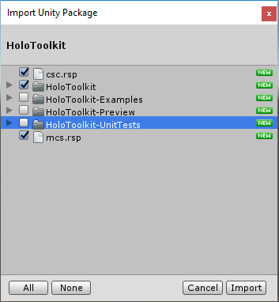
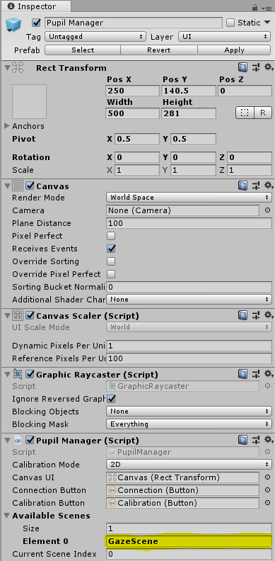
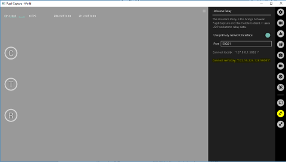
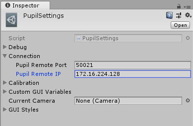
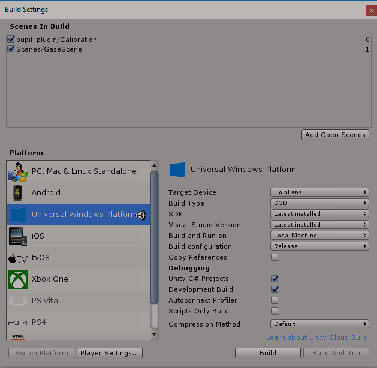

# Hololens PRL Selection methods (HeadGaze and EyeGaze)
-------------------------------------------------------

## HoloToolkit
--------------

You can find this software [here](https://github.com/Microsoft/MixedRealityToolkit-Unity).

Follow steps 1 to 3 from [here](https://github.com/Microsoft/MixedRealityToolkit-Unity/blob/master/GettingStarted.md) including the optional section in step 2:

* Open the folder you just cloned in Unity. Now, inside of Unity ensure you have the Assets folder selected in the project view, and export the package.

**IMPORTANT**: Make sure you select the root Assets folder in the Project. It contains important .rsp files like csc, gmcs and smcs.

* `Assets -> Export Package…`
* Name it HoloToolkit

* Open our project in Unity
* Then import the HoloToolkit asset using `Assets -> Import Package -> Custom Package…` [Navigate to the package you have exported above].

**NOTE**: The HoloToolkit-Examples and HoloToolkit-Test folders (and all its content and subfolders) are optional when you import the custom package. Uncheck those folders in the Import Unity Package window that shows all the contents of the package before performing the import (see image below).

## PupilLabs
------------

* Follow steps 1 to 6 [here](https://github.com/pupil-labs/hmd-eyes) under HoloLens Getting Started section.

* Drag the pupil_plugin folder (hmd-eyes-master\unity_pupil_plugin_hololens\Assets) and drop it under under the Assets directory in our project

* Open the Calibration Scene under the pupil_plugin directory you just copied and select Pupil Manager under the Hierarchy

* In the Inspector, look for the Pupil Manager section and write GazeScene in the Element 0 space (Available Scenes/Element 0)

* Go to Assets/pupil_plugin/Resources, select PupilSettings and in the Inspector, under Conection, specify the Remote Port and Remote IP you see in the Pupil Capture App -> Hololens Relay (Connect remotely: "IP:Port"). This in the windows computer running you will connect the Hololens cameras.

* Then open PupilGazeTracker.cs script (Assets/pupil_plugin/Scripts/Pupil) and comment the following three lines inside the VisualizeGaze method:

 * _markerLeftEye.UpdatePosition(PupilData._2D.LeftEyePosition);
 * _markerRightEye.UpdatePosition (PupilData._2D.RightEyePosition);
 * _markerGazeCenter.UpdatePosition (PupilData._2D.GazePosition);

## Deploy the App
-----------------

### Export to the Visual Studio solution
----------------------------------------

1. Open File > Build Settings window
2. Click Add Open Scenes to add the scenes.

    **IMPORTANT**: Make sure pupil_plugin/Calibration and Scenes/GazeScene scenes are shown in this order and are selected.

    

3. Change Platform to Universal Windows Platform and click Switch Platform.
4. In Windows Store settings ensure, SDK is Universal 10.
5. For Target device switch to HoloLens.
6. UWP Build Type should be D3D.
7. UWP SDK could be left at Latest installed.
8. Check Unity C# Projects and Development Build under Debugging.
9. Click Build.
10. In the file explorer, click New Folder and name the folder "App".
11. With the App folder selected, click the Select Folder button.
12. When Unity is done building, a Windows File Explorer window will appear.
13. Open the App folder in file explorer.
14. Open the generated Visual Studio solution (Gaze.sln in this case)

### Compile the Visual Studio solution
--------------------------------------

Finally, we will compile the exported Visual Studio solution, deploy it, and try it out on the device.

1. Using the top toolbar in Visual Studio, change the target from Debug to Release and from ARM to X86.
2. Click on the arrow next to the Local Machine button, and change the deployment target to Remote Machine.
3. Enter the IP address of your mixed reality device and change Authentication Mode to Universal (Unencrypted Protocol).
4. Click Debug > Start without debugging.

If this is your first time deploying to the Hololens, you will need to pair using [Visual Studio](https://docs.microsoft.com/en-us/windows/mixed-reality/using-visual-studio).

### Try out the app
-------------------

